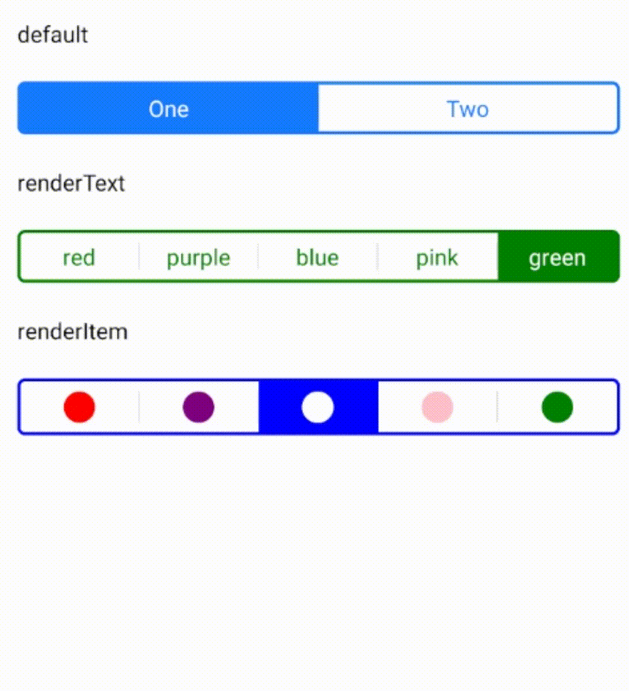
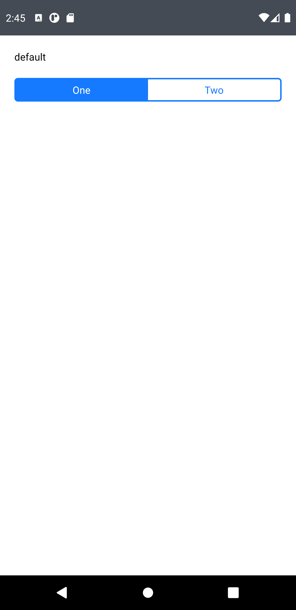
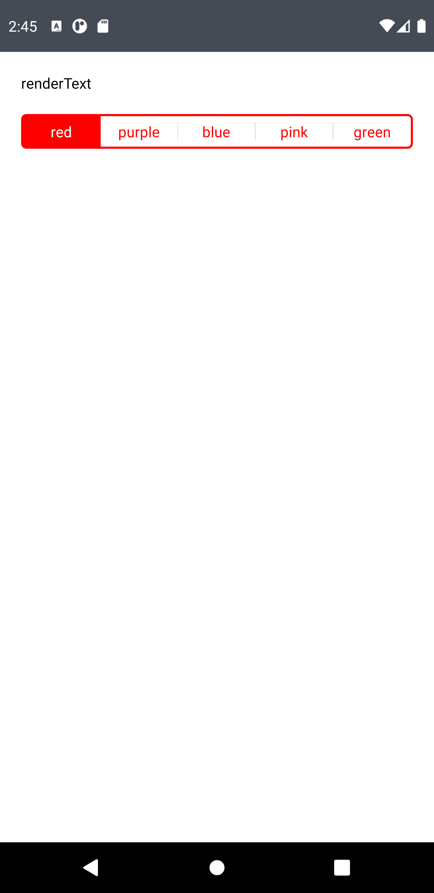
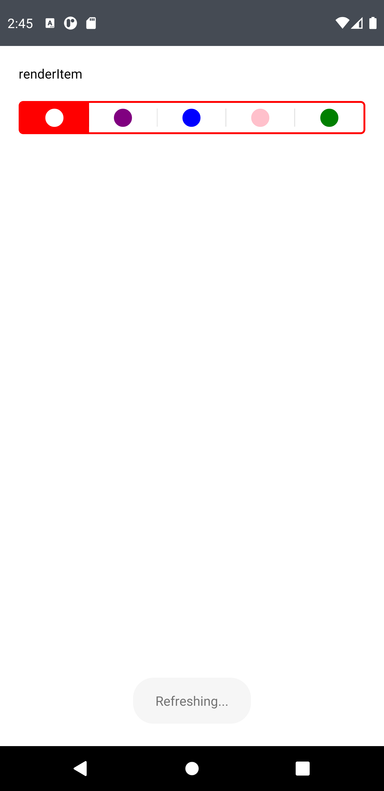

## React Native Segmented Controller



[](https://www.npmjs.com/package/react-native-segmented-controller)
[](https://www.npmjs.com/package/react-native-segmented-controller)

- [React Native Segmented Controller](#react-native-segmented-controller)
  - [Installation](#installation)
  - [Usage](#usage)
  - [Props](#props)
  - [Examples](#examples)
  - [License](#license)

### Installation

`npm install react-native-segmented-controller`

or

`yarn add react-native-segmented-controller`

### Usage

```javascript
import SegmentedController from "react-native-segmented-controller";
```

### Props

| Name             | Type                                                        | Default           | Description                                                                           |
| ---------------- | ----------------------------------------------------------- | ----------------- | ------------------------------------------------------------------------------------- |
| data             | string[]                                                    | **required**      | The labels for the control's segment buttons, in order.                               |
| selectedIndex    | number                                                      | 0                 | The index in `data` of the segment to be (pre)selected.                               |
| activeBackground | string                                                      | "#157aff"         | Color background when selected                                                        |
| activeText       | string                                                      |                   | Color text when selected                                                              |
| inactiveText     | string                                                      |                   | Color text when no selected                                                           |
| separateColor    | string                                                      | "rgba(0,0,0,0.1)" | Color separator bar between segments                                                  |
| renderText       | (item: object)                                              |                   |                                                                                       |
| renderItem       | (item: object,index: number,color: object,focused: boolean) |                   |                                                                                       |
| onChange         | (item: object, index: number)                               |                   | Callback that is called when the user taps a segment; passes the event as an argument |
| disabled         | boolean                                                     | false             | If true the user won't be able to interact with the control                           |
| activeOpacity    | number                                                      | 0.7               | Opacity when click                                                                    |
| containerStyles  | ViewStyle                                                   |                   |                                                                                       |
| textStyles       | TextStyle                                                   |                   |                                                                                       |
| separateStyles   | ViewStyle                                                   |                   |                                                                                       |

### Examples

**1** - Default

<p align="center">

</p>

```javascript
export default function index() {
  const [value, setvalue] = useState(0);
  return (
    <View>
      <View style={{ margin: 20 }}>
        <Text>default</Text>
      </View>
      <Segmented
        data={["One", "Two"]}
        selectedIndex={value}
        containerStyles={{ marginHorizontal: 20 }}
        onChange={(item, index) => setvalue(index)}
      />
    </View>
  );
}
```

**2** - Customizing render with renderText

<p align="center">

</p>

```javascript
export default function index() {
  const [value, setvalue] = useState(0);
  const data = [
    { color: "red" },
    { color: "purple" },
    { color: "blue" },
    { color: "pink" },
    { color: "green" },
  ];
  return (
    <View>
      <View style={{ margin: 20 }}>
        <Text>renderText</Text>
      </View>
      <Segmented
        data={data}
        activeBackground={data[value].color}
        selectedIndex={value}
        containerStyles={{ marginHorizontal: 20 }}
        renderText={(item) => item.color}
        onChange={(item, index) => setvalue(index)}
      />
    </View>
  );
}
```

**3** - Customizing render with renderItem

<p align="center">

</p>

```javascript
export default function index() {
  const [value, setvalue] = useState(0);
  const data = [
    { color: "red" },
    { color: "purple" },
    { color: "blue" },
    { color: "pink" },
    { color: "green" },
  ];
  return (
    <View>
      <View style={{ margin: 20 }}>
        <Text>renderItem</Text>
      </View>
      <Segmented
        data={data}
        activeBackground={data[value].color}
        selectedIndex={value}
        containerStyles={{ marginHorizontal: 20 }}
        renderItem={(item, index, color, focused) => {
          return (
            <Icon
              name="circle"
              color={focused ? color.activeText : item.color}
              size={20}
              solid
            />
          );
        }}
        onChange={(item, index) => setvalue(index)}
      />
    </View>
  );
}
```

### License

MIT

### Pull requests

Always welcome!
