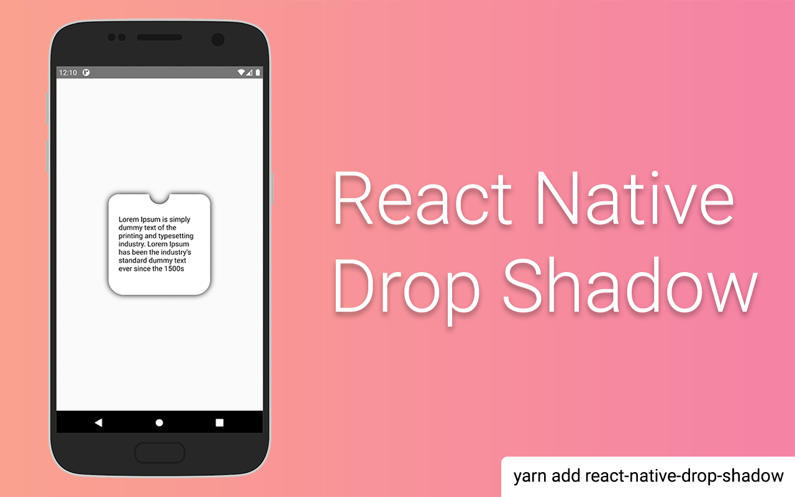

[](https://www.npmjs.com/package/react-native-drop-shadow) [](https://www.npmjs.com/package/react-native-drop-shadow)

The problem is that a shadows does not work with React Native in Android. This view takes its children's, creates a bitmap representation, blur it and color it to styles shadow values like in iOS

### Installation

`yarn add react-native-drop-shadow`

If you using `minSdkVersion = 16`:

`yarn add react-native-drop-shadow@0.0.4`

### Limitations

- Android has a bitmap limitation of 2048x2048, but this might depend on API version.
- Uses Bitmap Rendering to simulate the shadows which can be performance heavy if multiple shadows and animations are rendered at the same time.

### Usage

```js
import DropShadow from "react-native-drop-shadow";
```

```js
export default function usage() {
  return (
    <DropShadow
      style={{
        shadowColor: "#000",
        shadowOffset: {
          width: 0,
          height: 0,
        },
        shadowOpacity: 1,
        shadowRadius: 5,
      }}
    >
      ...
    </DropShadow>
  );
}
```

#### Usage with FlatList

```js
export default function withFlatList() {
  return (
    <FlatList
      data={[""]}
      keyExtractor={(item, index) => "List-" + index}
      CellRendererComponent={DropShadow} // <==== add line
      renderItem={({ item, index }) => (
        <DropShadow
          style={{
            shadowColor: "#000",
            shadowOffset: {
              width: 0,
              height: 0,
            },
            shadowOpacity: 1,
            shadowRadius: 5,
          }}
        >
          ...
        </DropShadow>
      )}
    />
  );
}
```

#### Usage with Animated Views

To make this work in place of an `Animated.View`, you need to use `Animated.createAnimatedComponent` to create an animatable version of `DropShadow`. For example:

```js
const AnimatedDropShadow = Animated.createAnimatedComponent(DropShadow);

export default function withAnimatedViews() {
  return (
    <AnimatedDropShadow
      style={{
        shadowColor: "#000",
        shadowOffset: {
          width: 0,
          height: 0,
        },
        shadowOpacity: 1,
        shadowRadius: 5,
      }}
    >
      ...
    </AnimatedDropShadow>
  );
}
```

You can then use `AnimatedDropShadow` in place of `Animated.View`.

### License

MIT

### Pull requests

Always welcome!
